  

  

---

## About Me

  

  Sou <strong>Analista de Dados</strong>, <strong>Desenvolvedor Back-End</strong>
  e <strong>Engenheiro de IA</strong>, com foco no desenvolvimento de aplicações,
  análise de dados e integração de soluções baseadas em Inteligência Artificial.

  Tenho interesse em <strong>Dados</strong>, <strong>Inteligência Artificial</strong>,
  <strong>Machine Learning</strong> e <strong>Engenharia de IA</strong>, buscando
  transformar dados e modelos inteligentes em soluções úteis para pessoas e empresas.

---

## Tech Stack

### Linguagens

  

### Back-End

  

### Dados e Análise

  

  
  
  
  

### Inteligência Artificial

  
  
  
  

### Banco de Dados

  

### DevOps e Ferramentas

  

---

## Engenharia de IA

  
  
  
  

  
  
  

---

## Linguagens Mais Utilizadas

  

---

  

---

  

